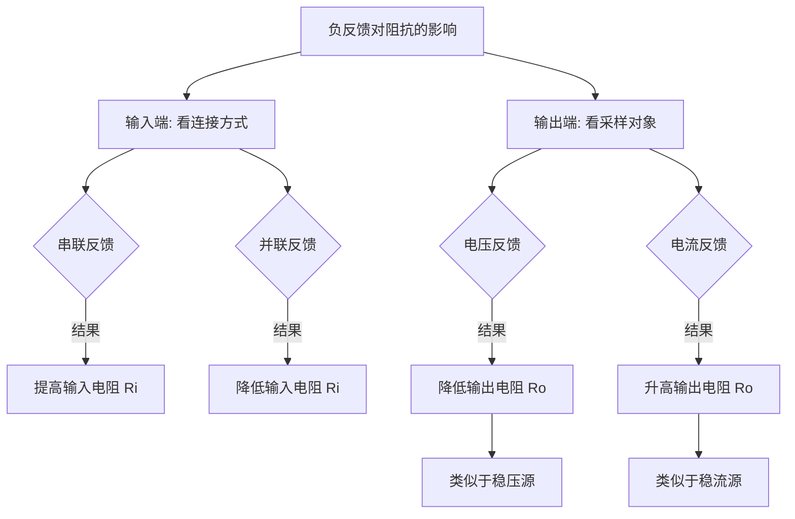

负反馈就像是给放大电路装上了一个“自动调节器”。虽然它以牺牲增益（放大倍数）为代价，但换取了电路各方面性能的全面提升。

以下是负反馈对电路性能的四大核心影响：

### 1. 提高增益的稳定性

这是负反馈最基本的作用。放大器内部的三极管参数会随温度变化或老化，导致开环增益 $A$ 不稳定。引入负反馈后，闭环增益为：

$$A_f = \frac{A}{1 + AF}$$

在深度负反馈（$AF \gg 1$）条件下，$A_f \approx 1/F$。

**结论：** 放大倍数几乎只取决于反馈网络（通常是极其稳定的电阻），而与不稳定的放大器本身无关。

#### 增益稳定性的推导

通过对 $A_f$ 关于 $A$ 求导：

1. 对 $A_f = \frac{A}{1+AF}$ 求微分：
    
    $$dA_f = \frac{(1+AF) \cdot dA - A \cdot (F \cdot dA)}{(1+AF)^2} = \frac{dA}{(1+AF)^2}$$
    
2. 为了看**相对变化率**，我们将两边除以 $A_f$：
    
    $$\frac{dA_f}{A_f} = \frac{dA}{(1+AF)^2} \div \frac{A}{1+AF}$$
    
3. 整理后得到右下角被圈起来的结论：
    
    $$\frac{dA_f}{A_f} = \frac{1}{1 + AF} \cdot \frac{dA}{A}$$
    

**闭环增益的相对变化率比开环增益的变化率缩小了 $(1+AF)$ 倍。**

- **稳定性大大增强**：
    
    假设开环增益 $A$ 因为温度变化波动了 **10%**，而你的反馈深度 $(1+AF)$ 等于 **100**。
    
    那么闭环增益 $A_f$ 的波动仅为：$10\% \div 100 = 0.1\%$。
    
- **牺牲增益换取精度**：
    
    这就是为什么在精密放大电路中，我们宁愿用**好几级放大器拼出一个巨大的 $A$**，再通过强负反馈把它压低，因为这样做出来的电路极其稳定，不随零件参数的微小漂移而改变。

### 2. 展宽通频带（带宽 $f_{BW}$）

简单一句话总结：**负反馈以牺牲增益（Gain）为代价，换取了频带（BW）的扩展。**

放大器在低频和高频端的增益都会下降。加了负反馈后，虽然中频增益降低了，但它对增益的“拉平”作用在整个频率范围内都在起作用。

- **高频端（Upper Cutoff）**：原开环截止频率为 $f_H$。加了负反馈后，由于闭环增益 $A_f$ 变小，电路能稳定工作的频率范围向高频延伸了。
    
- **低频端（Lower Cutoff）**：原开环截止频率为 $f_L$。同样的道理，低频响应也会向更低的方向延伸。
    

闭环后的频带宽度 $BW_f$ 与开环频带宽度 $BW$ 的关系如下：

$$f_{Hf} = f_H (1 + AF)$$

$$f_{Lf} = \frac{f_L}{1 + AF}$$

- **$f_L$ (Lower Cutoff Frequency)**：**开环**下限截止频率。即未加反馈时，放大器在低频端增益下降到中频增益 $0.707$ 倍（$-3\text{dB}$）处的频率。
    
- **$f_{Lf}$**：**闭环**下限截止频率。加了负反馈后的实际下限截止频率。

- **$f_H$**：开环（无反馈）时的上限截止频率。
    
- **$f_{Hf}$**：闭环（加了反馈）后的上限截止频率

因此，闭环频带宽度为：

$$BW_f = f_{Hf} - f_{Lf} \approx f_H (1 + AF)$$

(通常 $f_H \gg f_L$，所以高频端的提升决定了总带宽)。

**结论：带宽被拓宽了 $(1+AF)$ 倍。**

#### 增益-带宽积（GBW）常数

在负反馈电路中，有一个非常著名的结论：**增益-带宽积是一个常数。**

$$A \cdot f_H \approx A_f \cdot f_{Hf}$$

这就好比一块橡皮泥，你把它压得越扁（增益 $A_f$ 越小），它就铺得越开（带宽 $BW_f$ 越大）。

### 3. 减小非线性失真

**放大器 $A$ 往往是不完美的**。比如在大信号时，由于晶体管的饱和效应，它可能会把正半周放取得比较大，而把负半周放取得比较小（或者顶端削平）。

- 观察图 (a) 中 $X_o$ 的波形：你会发现它的正负半周不对称了，这就是**非线性失真**。
    
#### 负反馈的修复过程（观察图 b 的波形）

我们从上往下看右侧的三个波形：

- **第一行 $X_i$（输入信号）**：
    
    这是我们想要放大的原始信号，一个完美的、对称的正弦波。
    
- **第二行 $X_f$（反馈信号）**：
    
    因为 $X_f = F \cdot X_o$，所以反馈信号的长相和**失真了的输出波形**一模一样。注意看，$X_f$ 也是正负不对称的（比如负半周明显缩水了）。
    
- **第三行 $X_i'$（净输入信号）**：
    
    这是关键！根据负反馈定义：$X_i' = X_i - X_f$。
    
    - 在正半周：$X_f$ 很大，减去一个大的，剩下的 $X_i'$ 就变小了。
        
    - 在负半周：$X_f$ 比较小（缩水了），减去一个小的，剩下的 $X_i'$ 相对就保留得更多（看起来更“鼓”一点）。
        
    - **结果**：净输入信号 $X_i'$ 变成了一个**反向失真**的波形。它故意把负半周做得比正半周大，这就是所谓的“预失真”。
        

当这个长得“反向失真”的 $X_i'$ 进入那个“坏脾气”的放大器 $A$ 时：

1. 放大器原本想把负半周变小。
    
2. 但由于输入的负半周被负反馈提前补强了（变大了）。
    
3. **对冲之后**，输出波形 $X_o$ 的正负半周就变得基本对称了。

负反馈使非线性失真系数 $D$（Distortion）也降低了 $(1+AF)$ 倍：

$$D_f = \frac{D}{1+AF}$$

#### 特别提醒

这个“魔法”有一个前提：**失真必须发生在反馈环内部**。

如果你的输入信号本身就是坏的，负反馈是救不回来的。它只能修正放大器**自己产生的**那些毛病。

### 4. 改变输入电阻 ($R_i$) 和输出电阻 ($R_o$)

这是根据反馈组态（串/并、压/流）不同而产生的不同效果，也是设计电路时的关键考量：

#### ① 对输入电阻 $R_i$ 的影响（看串并联）

- **串联负反馈 (Series Feedback) $\rightarrow R_{if} \uparrow$**
    
    - **原理**：反馈电压 $U_f$ 与输入电压 $U_i$ 串联且极性相反，抵消了大部分 $U_i$，导致流进放大器的电流 $I_i$ 大大减小。
        
    - **公式**：
        
        $$R_{if} = R_i (1+AF)$$
        
    - **形象理解**：反馈信号像是在门口挡了一道，让信号源感觉“推不动”，所以电阻显得很大。

- **并联负反馈 (Shunt Feedback) $\rightarrow R_{if} \downarrow$**
    
    - **原理**：反馈电流 $I_f$ 与输入电流 $I_i$ 在输入节点并联，反馈电流“抽走”了大部分电流，为了维持电压，信号源必须提供更多电流。
        
    - **公式**：
        
        $$R_{if} = \frac{R_i}{1+AF}$$
        
    - **形象理解**：反馈信号在输入端开了一个“分流口”，电流更容易流进去了，所以电阻显得很小。
    

#### 图 6.5.1：串联负反馈的基本方框图
![[7.png|860]]
- **数学关系**：根据 KVL，$\dot{U}_i = \dot{U}_i' + \dot{U}_f$。
    
- **输入电阻 $R_{if}$ 的变化**：
    
    由于 $\dot{U}_f$ 的存在，为了产生同样的净输入电压 $\dot{U}_i'$，外界必须提供更大的 $\dot{U}_i$。这意味着从输入端看进去，电路变得更难“驱动”了。
    
    **结论**：串联负反馈会**提高**输入电阻。
    
    $$R_{if} = R_i (1 + \dot{A}\dot{F})$$
    
    
    这里的 $R_i$ 是基本放大电路（无反馈时）的输入电阻。加了反馈后，**输入电阻增大了 $(1+AF)$ 倍。**

    

#### 图 6.5.2：考虑 $R_b$ 在反馈环之外的情况
![[8.png|752]]

- **结构特点**：
    
    - **$R_{if}'$**：指**反馈环内部**的输入电阻。它的推导结论和上面一样，即 $R_{if}' = R_i(1+AF)$，是一个很大的值。
        
    - **$R_{if}$**：指**整个电路**（包含偏置电阻 $R_b$）的总输入电阻。
        
- **物理意义**：
    
    你会发现 $R_b$ 与反馈环的输入端是**并联**关系。
    
- **计算公式**：
    
    $$R_{if} = R_b \parallel R_{if}' = R_b \parallel [R_i(1 + \dot{A}\dot{F})]$$
    

#### ② 对输出电阻 $R_o$ 的影响（看压流反馈）

1. **电压负反馈：追求“稳压”**

- **目标**：不管负载怎么变，输出电压 $U_o$ 都要纹丝不动。
    
- **对抗逻辑**：如果输出电压 $U_o$ 因为某种原因（比如负载变重）想下降，反馈网络会侦测到这种趋势，并命令放大器内部调大输出，把电压“顶”回去。
    
- **数学体现**：
    
    $$R_{of} = \frac{R_o}{1+AF}$$
    
    （内阻被大幅度“压扁”了）。

 2. **电流负反馈：追求“稳流”**

- **目标**：不管负载电阻多大，输出电流 $I_o$ 都要保持恒定。
    
- **对抗逻辑**：如果输出电流 $I_o$ 想要减小，反馈网络会命令放大器大幅提高输出电压，强行把电流“推”过去。
    
- **等效结果**：为了保住电流，电压可以随负载剧烈波动，这正是高阻抗恒流源的特征。
    
- **数学体现**：
    
    $$R_{of} = R_o (1+AF)$$
    
    （内阻被大幅度“拉高”了）。

### 总结表

|**反馈类型**|**物理效果**|**阻抗变化**|**变化倍数**|
|---|---|---|---|
|**串联 (Series)**|提高采样电压能力|$R_{if} \uparrow$|$\times (1+AF)$|
|**并联 (Shunt)**|提高接收电流能力|$R_{if} \downarrow$|$\div (1+AF)$|
|**电压 (Voltage)**|稳定输出电压 (稳压)|$R_{of} \downarrow$|$\div (1+AF)$|
|**电流 (Current)**|稳定输出电流 (稳流)|$R_{of} \uparrow$|$\times (1+AF)$|

![[3bfea74f3ac24fe39f270028143f2c1e.png]]
### 图（5）解释：根据信号源要求（匹配 Ri）

信号源不是理想的，它有内阻。为了让信号尽可能完整地进入放大器，我们需要调节放大器的**输入电阻 $R_i$**。

#### 1. 信号源为电压源（内阻较小） $\rightarrow$ 引入 **串联** 负反馈

- **逻辑：** 电压源最怕“压降”。如果放大器的 $R_i$ 太小，信号源内阻就会分走大量电压。
    
- **组态特点：** 串联负反馈能**大幅提高** $R_i$。
    
- **结果：** 放大器 $R_i$ 变得极大，几乎不向信号源索取电流，从而保证采集到的电压就是信号源的电动势。
    

#### 2. 信号源为电流源（内阻较大） $\rightarrow$ 引入 **并联** 负反馈

- **逻辑：** 电流源最怕“阻碍”。如果放大器的 $R_i$ 太大，电流就流不动了。
    
- **组态特点：** 并联负反馈能**大幅降低** $R_i$。
    
- **结果：** 放大器 $R_i$ 变得极小，像一个“电流抽水机”，能把电流源的电流全部抽进来。

![[210dcbe203c5769b46c0930ec7d36a35.png|757]]

### 图（6）解释：根据信号变换要求（确定输出 Ro）

这里决定了放大器最终扮演什么角色（是电压源、电流源，还是转换器）。

#### 1. $I \rightarrow V$ (跨阻放大器) $\rightarrow$ **电压并联**

- **输入：** 既然输入是电流 ($I$)，需要低阻，所以选**并联**。
    
- **输出：** 既然输出是电压 ($V$)，需要稳定电压（低 $R_o$），所以选**电压**反馈。
    
- **典型应用：** 光敏二极管（产生电流信号）转电压信号。
    

#### 2. $V \rightarrow V$ (电压放大器) $\rightarrow$ **电压串联**

- **输入：** 输入是电压 ($V$)，需要高阻，所以选**串联**。
    
- **输出：** 输出是电压 ($V$)，需要稳压，所以选**电压**反馈。
    
- **典型应用：** 普通的音频放大、传感器电压调理。
    

#### 3. $V \rightarrow I$ (互导放大器) $\rightarrow$ **电流串联**

- **输入：** 输入是电压 ($V$)，需要高阻，所以选**串联**。
    
- **输出：** 输出是电流 ($I$)，需要稳流（高 $R_o$），所以选**电流**反馈。
    
- **典型应用：** 电流源电路、压控电流源（VCCS）。（就像你刚才算的那个三极管电路）
    

#### 4. $I \rightarrow I$ (电流放大器) $\rightarrow$ **电流并联**

- **输入：** 输入是电流 ($I$)，需要低阻，所以选**并联**。
    
- **输出：** 输出是电流 ($I$)，需要稳流，所以选**电流**反馈。
    
- **典型应用：** 电流采样放大。
    

### 💡 核心记忆方法（避坑指南）

这两张图其实可以用一句话概括：

- **看前端（输入）：** 想测电压就选**串联**（高阻），想吸电流就选**并联**（低阻）。
    
- **看后端（输出）：** 想输出稳压就选**电压**（低阻），想输出稳流就选**电流**（高阻）。
    

## 总结对照表

|**性能指标**|**影响结果**|**记忆窍门**|
|---|---|---|
|**增益 $A$**|**减小**|以量换质|
|**增益稳定性**|**提高**|深度负反馈下 $A_f \approx 1/F$|
|**通频带 $BW$**|**展宽**|低频更低，高频更高|
|**非线性失真**|**减小**|环内自动修正|
|**输入电阻 $R_i$**|**串大并小**|串联挡电流，并联吸电流|
|**输出电阻 $R_o$**|**压小流大**|电压反馈稳压，电流反馈稳流|
